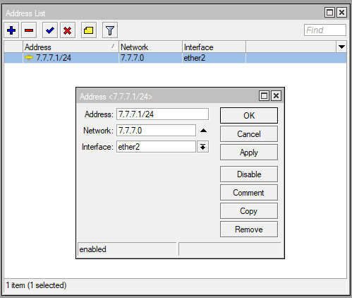

# LAB-17-ARP-dan-Static-ARP
Minggu 17 Agustus 2025

# ARP dan Static ARP
  ARP (Address Resolution Protocol) adalah protokol yang digunakan untuk mencocokkan alamat IP dengan alamat fisik perangkat (MAC Address) di jaringan lokal. Router menyimpan pasangan IP dan MAC tersebut dalam tabel ARP agar komunikasi data bisa berjalan. Secara default entri ARP ditambahkan otomatis, tetapi untuk keamanan bisa dibuat secara manual (static ARP), sehingga hanya perangkat dengan kombinasi IP dan MAC yang sesuai yang akan dilayani oleh router.

# Konfigurasi ARP dan Static ARP  
  
# ARP STATIC  
*Note: Pastikan interface saat mengkonfig berbeda dengan interface yang sedang di konfig, karna nanti jika sudah langkah ke-3, mikrotik akan DC sampai menganti int-nya.*  
1. Setting IP laptop di Control panel.  
   address: 9.9.9.9  
   submask: 255.255.255.0  
2. Sambungkan Router ke Laptop mengunakan eth1 dan buka Winbox  
3. Tambahkan IP Address "9.9.9.1" pada eth2. **IP > Address > add**  
  
4. Buka property eth2 dan ganti ARP modenya jadi **reply-only**. Pada kondisi ini, interface Router hanya akan meresponse request client dengan kombinasi IP Address dan MAC Address yang sesuai dengan tabel ARP.  

5. Sekarang kita lihat IP Addrs dan MAC Addrs laptop mengunakan perintah **ipconfig /all** di cmd. Lihat bagian **IPv4 Address** untuk melihat IP Address dan **Physical Address** untuk melihat MAC Address.  

6. Setalah itu buka **IP > ARP** dan tambahkan ARP untuk ether2 lalu masukan IP Address dan MAC Address Laptop.  

7. Untuk mengeceknya, kita bisa coba login mengunakan eth2 dan IP ke Winbox, dengan IP laptop yang sesuai dengan ARP.
8. Dan sekarang coba kita login ke winbox lagi tapi IP laptop tidak sesuai dengan ARP.
  
9. Dan hsailnya tidak akan bisa login.
  

# ARP pada Jaringan DHCP
1. Pertama-tama buat IP static di ether2. **IP > Address > Add**  
  
2. Setup DHCP server untuk ether2. **IP > DHCP SERVER**  
  
  
3. Jika sudah buka property DHCP server yang telah tadi dibuat. Lalu checklist opsi **Add ARP for Leases**. Fungsinya adalah setiap kali DHCP memberikan alamat IP ke klien, router akan otomatis membuat entri ARP sesuai dengan IP dan MAC Address klien tersebut.  
  
4. Ubah ARP menjadi **reply-only** untuk ether2 di menu **interfaces**.  
  
5. Sekarang ubah IP di PC jadi DHCP client atau Obtain Auto.  
  
6. Cek ARP LIST di **IP > ARP**, jika berhasil mac dan ip laptop akan ada disana.  
  
7. Sekarang kita coba ganti IP windows menjadi IP yang sama seperti diatas tapi static.  
  
8. Saat IP windows sudah di ubah, winbox akan langsung DC dan kita tidak akan bisa login ke winbox.  
  
  
  
# Keterangan FLAG di ARP
D = Dynamic, dibuat otomatis oleh router.  
X = Disabled, ARP dimatikan.  
C = Complete, pasangan IP dan MAC valid, sudah ketemu dengan benar.  
I = Incomplete, router tahu ada IP, tapi belum berhasil dapat MAC address-nya.  

# Kesimpulan  
Pada dasarnya, Address Resolution Protocol berfungsi untuk menerjemahkan alamat IP menjadi alamat fisik (MAC Address). ARP memiliki dua jenis, yaitu dynamic dan static. ARP dynamic bersifat otomatis dan praktis namun kurang aman karena klien bebas mengganti IP. Sebaliknya, ARP static lebih aman karena hanya mengizinkan kombinasi IP–MAC yang sesuai, meskipun kurang efisien jika jumlah klien banyak.  
  
# Sumber 
Citraweb - https://citraweb.com/artikel/56/
